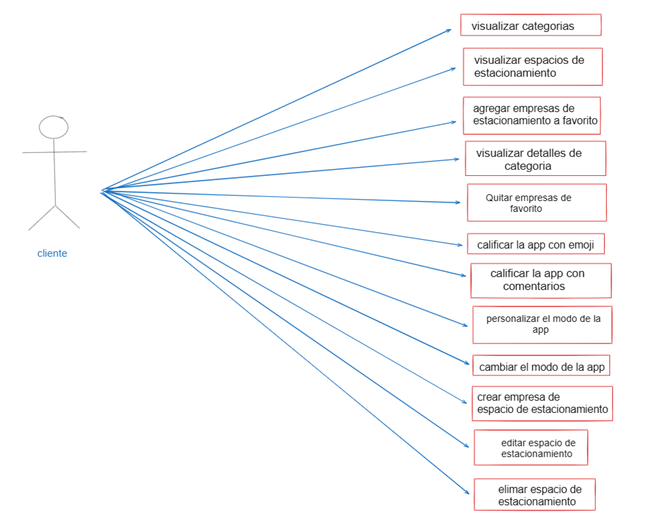
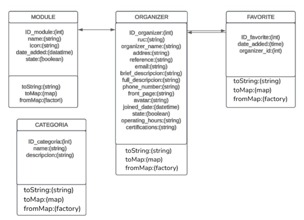
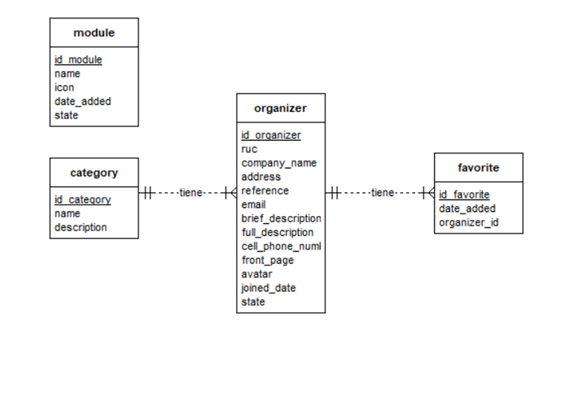
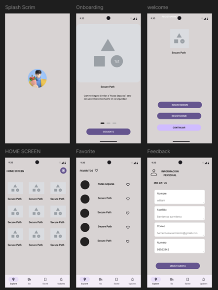

# Documentación de la aplicación de medicina

Puquio, capital de la provincia de Lucanas en Ayacucho, Perú, al igual que muchas ciudades en desarrollo, enfrenta desafíos en la gestión del estacionamiento vehicular.  La falta de un sistema organizado de estacionamiento genera problemas de congestión vial, pérdida de tiempo para los conductores en la búsqueda de espacios disponibles, falta de seguridad para los vehículos estacionados, e ingresos perdidos para la municipalidad por la falta de control del estacionamiento informal.  Actualmente, la gestión del estacionamiento se basa principalmente en métodos informales y poco eficientes, lo que afecta la calidad de vida de los residentes y la imagen de la ciudad.  Una aplicación móvil de parqueo podría ofrecer una solución moderna y eficiente a esta problemática.

Existe una necesidad urgente de implementar un sistema de gestión de
estacionamiento eficiente en Puquio, Lucanas.  Esta necesidad se manifiesta en
la falta de soluciones tecnológicas que aborden los problemas de congestión
vehicular, la   búsqueda ineficiente de estacionamiento, la inseguridad de los
vehículos estacionados y la falta de control del estacionamiento informal.  Una
aplicación móvil de parqueo se presenta como una solución viable para
optimizar el uso del espacio público, generar ingresos para la municipalidad,
mejorar la seguridad vial y la experiencia de los conductores.  La aplicación
debe facilitar la búsqueda de estacionamiento, permitir reservas y pagos
digitales, e integrar información relevante sobre tarifas y regulaciones.

1.2.	Nombre del Producto
Aplicación Móvil (Parkealo)
1.3.	Objetivo del Producto
Facilitar la búsqueda y reserva de espacios de estacionamiento en Puquio, brindando una experiencia segura, eficiente y cómoda a los conductores.
1.4.	Alcance del Producto
Registro y control de acceso: Gestión automática de entrada y salida de vehículos mediante escaneo de placas.
Gestión de tarifas: Cálculo de tarifas y soporte para múltiples métodos de pago.
Facturación y reportes: Generación de facturas electrónicas y reportes detallados.
Servicios adicionales: Inclusión de servicios como lavado de autos y gestión de reservas.
Monitoreo y seguridad: Supervisión en tiempo real de vehículos en el estacionamiento.

2.3.1.	 Caso de uso: “elegir distintas empresas”
•	Actor principal: Usuario
•	Descripción: El usuario accede a la aplicación, se ubica en el menú principal y elige las distintas empresas para visualizar su información detallada.
•	Actor secundario: Sistema (interfaz de usuario, base de datos)
2.3.2.	 Caso de uso: “ver lista de empresas de estacionamiento”
•	Actor principal: Usuario
•	Descripción: El usuario quiere ver una lista de empresas de estacionamiento con sus nombres y ubicaciones.
•	Actor secundario: Sistema (interfaz de usuario, base de datos)

2.3.3.	Caso de uso: “ver información detallada de la empresa de estacionamiento”
•	Actor principal: Usuario
•	Descripción: El usuario selecciona una empresa de estacionamiento y visualiza su información detallada, incluyendo dirección, tarifas, horarios de operación y servicios ofrecidos.
•	Actor secundario: Sistema (interfaz de usuario, base de datos)
2.3.4.	 Caso de uso: “visualizar espacios de estacionamiento por categorías”
•	Actor principal: Usuario
•	Descripción: El usuario desea ver los espacios de estacionamiento organizados por categorías para encontrar servicios relacionados.
•	Actor secundario: Sistema (interfaz de usuario, base de datos)
2.3.5.	Caso de uso: “cambiar el modo de la app”
•	Actor principal: Usuario
•	Descripción: El usuario quiere cambiar el modo de la aplicación (ej., modo oscuro/claro) para adaptarlo a sus preferencias.
•	Actor secundario: Sistema (interfaz de usuario, configuración)
2.3.6.	 Caso de uso: “personalizar el modo de la app”
•	Actor principal: Usuario
•	Descripción: El usuario desea personalizar varios aspectos del modo de la aplicación para mejorar su experiencia de uso.
•	Actor secundario: Sistema (interfaz de usuario, configuración)
2.3.7.	Caso de uso: “guardar espacios de estacionamiento en favoritos”
•	Actor principal: Usuario
•	Descripción: El usuario quiere guardar ciertos espacios de estacionamiento en una lista de favoritos para acceder a ellos rápidamente en el futuro.
•	Actor secundario: Sistema (interfaz de usuario, base de datos)
2.3.8.	 Caso de uso: “quitar espacios de estacionamiento de favoritos”
•	Actor principal: Usuario
•	Descripción: El usuario desea quitar espacios de estacionamiento de su lista de favoritos para mantenerla organizada.
•	Actor secundario: Sistema (interfaz de usuario, base de datos)

2.3.9.	 Caso de uso: “calificar y escribir comentarios sobre los espacios de estacionamiento”
•	Actor principal: Usuario
•	Descripción: El usuario quiere calificar y escribir comentarios sobre los espacios de estacionamiento que ha utilizado para ayudar a otros usuarios a tomar decisiones informadas.
•	Actor secundario: Sistema (interfaz de usuario, base de datos)
2.3.10.	 Caso de uso: “crear lugares de estacionamiento”
•	Actor principal: Usuario
•	Descripción: El usuario desea crear lugares de estacionamiento para promocionar su emprendimiento.
•	Actor secundario: Sistema (interfaz de usuario, base de datos)

	Requisitos del Usuario
3.	Modelado del Sistema
El modelo de sistema es una diciplina que busca representar la realidad y los procesos de un sistema complejo mediante modelos matemáticos gráficos y diagramas.

